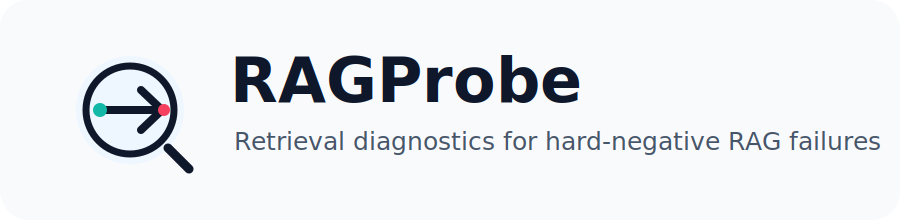

<p align="center">
  
</p>

<p align="center">
  <a href="https://pypi.org/project/ragprobe-diagnostics/"></a>
  <a href="https://github.com/wangmengxxxi/RAGprobe/blob/main/LICENSE"></a>
  
  
</p>

# RAGProbe

> 在用户发现 RAG 检索问题之前，先让 RAGProbe 把问题找出来。

RAGProbe 是一个面向 RAG 系统的**检索层诊断与回归测试工具**。它不评估最终
LLM 答案写得好不好，而是专注回答一个更靠前也更关键的问题：

```text
你的 retriever 是否能找对 chunk，并避开那些“看起来很像但其实错了”的 chunk？
```

RAGProbe 可以作为 CLI、Python API、CI 检查工具使用，也支持 Python、Node.js、
任意 JSONL 子进程、HTTP 服务等跨语言 retriever 接入。

## 功能

- **hard negative 抗性测试**：不只看"找没找到正确 chunk"，还显式检测"相似但错误的 chunk 是否被误召回"——这是其他 RAG 评估工具不覆盖的盲区。
- **混淆维度诊断**：自动识别 retriever 在哪个维度犯错（品牌混淆？主体混淆？时间混淆？），输出可操作的改进方向，而不只是一个笼统的分数。
- **检索方法无关**：不限于向量检索。BM25、grep、混合检索、任何能返回 chunk 的系统都能接入。
- **核心诊断零 LLM**：`run`、`diagnose`、`compare`、`check` 全部确定性执行，不需要 API key，CI 里跑不会因为 rate limit 挂掉。
- **一次生成，永久回归**：测试集生成一次后可作为回归资产反复使用。改 chunking、embedding、reranker 前后稳定对比，无额外成本。
- **跨语言接入**：Python 函数、stdin/stdout JSONL 子进程、HTTP endpoint 三种方式，Java/Go/Node.js/Rust 都能接。
- **可选 LLM 增强**：需要更自然的 query 或交叉验证时，可调用 Qwen 或 OpenAI-compatible API。不需要时完全不依赖。
- **内置 baseline 对照**：`lexical` 和本地 `embedding` baseline 开箱即用，无需外部模型即可建立对照基线。

## 解决痛点

很多开源 RAG 评估工具更关注最终答案质量，或者依赖 LLM judge 给 answer 打分。
这当然有价值，但工程落地时，retrieval 层经常先出问题：正确 chunk 没进
top-k，相似但错误的 chunk 排在正确 chunk 前面，或者一次 chunking/embedding
调整悄悄引入回归。

RAGProbe 主要补齐这些空白：

- **只看 answer 分数不够定位问题**：最终答案错了，可能是 prompt、generator、
  retriever、reranker、chunking 中任何一环的问题。RAGProbe 直接诊断 retrieval
  结果，让问题先在检索层被定位。
- **hit rate 不足以衡量 RAG 检索质量**：很多系统能召回正确 chunk，但同时也把
  高相似错误 chunk 放到前排。RAGProbe 用 hard-negative FPR 专门衡量这种风险。
- **LLM judge 成本和不稳定性不适合所有 CI 场景**：RAGProbe 的核心指标是确定性
  计算，`diagnose`、`compare`、`check` 不需要 API key，也不会受模型漂移影响。
- **跨语言系统接入门槛高**：真实 RAG 系统可能是 Java、Go、Node.js、Rust 或
  HTTP 服务。RAGProbe 支持 JSONL 子进程和 HTTP endpoint，不要求用户重写系统。
- **缺少可复用的回归资产**：RAGProbe 把测试集、hard negatives、bad cases、
  audit report、repair plan 都保存为 JSON artifact，方便长期维护和版本比较。
- **诊断报告不够可操作**：RAGProbe 不只输出分数，还输出 confusion distribution、
  failure patterns 和建议，帮助判断是 metadata filter、reranking、召回覆盖还是
  chunk 设计出了问题。


## 安装


```bash
pip install ragprobe-diagnostics
```

本地开发安装：

```bash
python -m pip install -e ".[dev]"
```

查看版本：

```bash
python -m ragprobe --version
```

## 快速开始

运行内置 demo：

```bash
python -m ragprobe demo
```

使用示例 Python retriever 跑测试集：

```bash
python -m ragprobe run \
  --testset examples/contract/testset.json \
  --retriever examples/contract/python_retriever.py \
  --output .tmp/contract-results.json

python -m ragprobe diagnose \
  --testset examples/contract/testset.json \
  --results .tmp/contract-results.json
```

生成 Markdown 报告：

```bash
python -m ragprobe diagnose \
  --testset examples/contract/testset.json \
  --results .tmp/contract-results.json \
  --format markdown \
  --output .tmp/contract-report.md
```

不写 retriever，直接跑内置 embedding baseline：

```bash
python -m ragprobe run \
  --testset examples/contract/testset.json \
  --baseline embedding \
  --output .tmp/embedding-baseline-results.json
```

## 输入数据格式

### chunks.jsonl

最低要求只需要 `chunk_id` 和 `content`：

```jsonl
{"chunk_id":"c1","content":"买方逾期付款超过30天，应按未付款金额支付违约金。"}
{"chunk_id":"c2","content":"卖方延期交货超过15日，应承担延期交货违约责任。"}
```

`metadata` 不是必填项。没有 metadata 时，RAGProbe 仍可生成测试集和诊断指标；
有 metadata 时，confusion label 会更细：

```jsonl
{"chunk_id":"p1","content":"华为手机支持66W快充。","metadata":{"brand":"华为","category":"phone"}}
{"chunk_id":"p2","content":"小米手机支持67W快充。","metadata":{"brand":"小米","category":"phone"}}
```

可能得到的 confusion type：

```text
brand_confusion
category_confusion
numeric_confusion
semantic_only
```

`url`、`page`、`id`、时间戳等非语义字段会被忽略，避免污染诊断标签。

### testset.json

测试集由 query、expected chunks 和 hard negatives 组成：

```json
{
  "name": "contract-demo",
  "metadata": {
    "chunks": {
      "buyer_payment_30": "买方逾期付款超过30天，应按未付款金额支付违约金。",
      "seller_delivery_15": "卖方延期交货超过15日，应承担延期交货违约责任。"
    }
  },
  "cases": [
    {
      "id": "case_1",
      "query": "买方逾期付款超过30天的违约金是多少？",
      "expected_chunks": ["buyer_payment_30"],
      "hard_negatives": [
        {
          "chunk_id": "seller_delivery_15",
          "confusion_type": "subject_confusion",
          "similarity_to_correct": 0.94,
          "reason": "同为违约责任条款，但主体和事件不同。"
        }
      ],
      "difficulty": "hard"
    }
  ]
}
```

## 生成测试集：默认确定性规则，可选 LLM

RAGProbe 的 `generate` 命令有两种路径：

- 默认路径是**确定性规则生成**，不调用任何模型，适合冷启动、CI 和没有 API key 的环境。
- 显式传入 `--llm qwen` 或 `--llm openai-compatible` 时，才会启用 LLM 辅助生成。

默认确定性生成示例：

```bash
python -m ragprobe generate \
  --chunks examples/contract/chunks.jsonl \
  --output .tmp/generated-testset.json \
  --hard-negative-top-k 2 \
  --hn-strategy hybrid \
  --quality-report .tmp/generated-quality.md

python -m ragprobe validate --testset .tmp/generated-testset.json
```

加入真实线上 bad case。`add-case` 不依赖 LLM，适合把生产环境里真的失败过的
query 固化成长期回归测试：

```bash
python -m ragprobe add-case \
  --testset .tmp/generated-testset.json \
  --output .tmp/generated-testset-with-bad-case.json \
  --query "买方逾期付款的责任是什么？" \
  --expected-chunk buyer_payment_30 \
  --hard-negative seller_delivery_15 \
  --confusion-type subject_confusion
```

## 可选 LLM 生成与审计

默认生成路径是确定性的。若想让模型生成更自然的 query，或在生成时验证 QA 和
hard negative，可以启用 LLM。RAGProbe 支持 Qwen 预设，也支持通用
OpenAI-compatible chat completions API。

环境变量默认读取 `AI_API_KEY`；如果你想使用 `DASHSCOPE_API_KEY`、
`OPENAI_API_KEY` 或团队内部统一的环境变量名，可以通过 `--api-key-env` 指定：

```bash
export AI_API_KEY="..."
```

Windows PowerShell：

```powershell
$env:AI_API_KEY="..."
```

Qwen 示例：

```bash
python -m ragprobe generate \
  --chunks examples/contract/chunks.jsonl \
  --output .tmp/qwen-testset.json \
  --llm qwen \
  --model qwen-plus \
  --llm-validate \
  --yes \
  --quality-report .tmp/qwen-quality.md
```

OpenAI-compatible 示例：

```bash
python -m ragprobe generate \
  --chunks examples/contract/chunks.jsonl \
  --output .tmp/llm-testset.json \
  --llm openai-compatible \
  --base-url https://dashscope.aliyuncs.com/compatible-mode/v1/chat/completions \
  --model qwen-plus \
  --api-key-env AI_API_KEY \
  --yes
```

例如使用 DashScope 常见的 `DASHSCOPE_API_KEY`：

```bash
python -m ragprobe generate \
  --chunks examples/contract/chunks.jsonl \
  --output .tmp/qwen-testset.json \
  --llm qwen \
  --model qwen-plus \
  --api-key-env DASHSCOPE_API_KEY \
  --yes
```

指定领域上下文（`--domain-hint`）可以让 LLM 生成更贴合领域的 query 风格：

```bash
python -m ragprobe generate \
  --chunks examples/medical/chunks.jsonl \
  --output .tmp/medical-testset.json \
  --llm qwen \
  --model qwen-plus \
  --domain-hint "医疗器械注册审评文档" \
  --yes
```

不传 `--domain-hint` 时，LLM 会从 chunk 内容自动推断语言和风格。

注意：

- 不要把 API key 写进代码、测试集、缓存或提交记录。
- `.ragprobe_cache/` 默认用于缓存 LLM 调用结果，已经建议加入 `.gitignore`。
- `diagnose`、`compare`、`check` 仍然不需要 LLM。

测试集审计：

```bash
python -m ragprobe audit \
  --testset examples/contract/testset.json \
  --output .tmp/audit.json \
  --markdown .tmp/audit.md \
  --llm qwen \
  --model qwen-plus \
  --sample-size 5
```

生成可人工审核的修复计划：

```bash
python -m ragprobe repair-plan \
  --audit-report .tmp/audit.json \
  --output .tmp/repair-plan.json \
  --markdown .tmp/repair-plan.md
```

应用安全修复到新测试集文件：

```bash
python -m ragprobe apply-audit-fixes \
  --testset examples/contract/testset.json \
  --repair-plan .tmp/repair-plan.json \
  --output .tmp/fixed-testset.json \
  --report .tmp/repair-apply.md
```

## 跨语言 retriever 接入

RAGProbe 不要求你的 RAG 系统用 Python 写。只要能把 query 转成 retrieved chunks，
就可以接入。

### 方式一：Python 文件

提供一个暴露 `retrieve(query, top_k)` 的 Python 文件：

```python
def retrieve(query: str, top_k: int = 10) -> list[dict]:
    return [
        {
            "chunk_id": "buyer_payment_30",
            "content": "买方逾期付款超过30天，应按未付款金额支付违约金。",
            "score": 0.95,
            "metadata": {"source": "contract.md"},
        }
    ][:top_k]
```

运行：

```bash
python -m ragprobe run \
  --testset examples/contract/testset.json \
  --retriever examples/contract/python_retriever.py \
  --output .tmp/python-results.json
```

### 方式二：Node.js 或任意 JSONL 子进程

RAGProbe 会向子进程 stdin 逐行写入请求：

```jsonl
{"query":"买方逾期付款超过30天的违约金是多少？","top_k":10}
```

子进程需要向 stdout 逐行返回 JSON 数组：

```jsonl
[{"chunk_id":"buyer_payment_30","content":"买方逾期付款超过30天，应按未付款金额支付违约金。","score":0.95}]
```

Node.js 最小示例：

```javascript
const readline = require("readline");

const chunks = [
  {
    chunk_id: "buyer_payment_30",
    content: "买方逾期付款超过30天，应按未付款金额支付违约金。",
  },
  {
    chunk_id: "seller_delivery_15",
    content: "卖方延期交货超过15日，应承担延期交货违约责任。",
  },
];

const rl = readline.createInterface({ input: process.stdin });

rl.on("line", (line) => {
  const request = JSON.parse(line);
  const topK = request.top_k || 10;
  const results = chunks
    .map((chunk) => ({
      ...chunk,
      score: request.query.includes("买方") && chunk.chunk_id.includes("buyer") ? 1.0 : 0.3,
    }))
    .sort((a, b) => b.score - a.score)
    .slice(0, topK);
  console.log(JSON.stringify(results));
});
```

运行：

```bash
python -m ragprobe run \
  --testset examples/contract/testset.json \
  --retriever-cmd "node examples/contract/node_jsonl_retriever.js" \
  --output .tmp/node-results.json
```

这个协议对任何语言都一样：Java、Go、Rust、C#、PHP 只要能读 stdin、写 stdout
JSONL，就能接入。

### 方式三：HTTP endpoint

单条请求：

```http
POST /search
Content-Type: application/json

{"query":"买方逾期付款超过30天的违约金是多少？","top_k":10}
```

返回：

```json
[
  {
    "chunk_id": "buyer_payment_30",
    "content": "买方逾期付款超过30天，应按未付款金额支付违约金。",
    "score": 0.95
  }
]
```

运行：

```bash
python -m ragprobe run \
  --testset examples/contract/testset.json \
  --endpoint http://127.0.0.1:8008/search \
  --endpoint-config examples/contract/endpoint_config.json \
  --output .tmp/http-results.json
```

`endpoint_config.json` 可配置 headers、timeout、batch size：

```json
{
  "headers": {
    "Authorization": "Bearer dev-token"
  },
  "timeout": 30,
  "batch_size": 1
}
```

## Python API

```python
from ragprobe import RAGProbe

probe = RAGProbe()

testset = probe.generate(
    chunks="examples/contract/chunks.jsonl",
    hard_negative_top_k=2,
)

# LLM 生成时可指定领域上下文
testset = probe.generate(
    chunks="examples/medical/chunks.jsonl",
    llm="qwen",
    domain_hint="医疗器械注册审评文档",
)

# AI 参数既可以在初始化时作为默认值传入
probe = RAGProbe(
    llm="qwen",
    model="qwen-plus",
    api_key_env="DASHSCOPE_API_KEY",
)

testset = probe.generate(
    chunks="examples/contract/chunks.jsonl",
    llm_validate=True,
)

# 本地快速试用时，也可以直接传 api_key；不要把真实 key 提交到仓库
probe = RAGProbe(
    llm="qwen",
    model="qwen-plus",
    api_key="sk-...",
)

# 也可以在单次调用时覆盖 AI 参数
testset = probe.generate(
    chunks="examples/contract/chunks.jsonl",
    llm="openai-compatible",
    base_url="https://dashscope.aliyuncs.com/compatible-mode/v1/chat/completions",
    model="qwen-plus",
    api_key="sk-...",
    api_key_env="DASHSCOPE_API_KEY",
    llm_validate=True,
)

audit = probe.audit(
    testset=testset,
    llm="qwen",
    model="qwen-plus",
    api_key_env="DASHSCOPE_API_KEY",
    sample_size=5,
)

results = probe.run(
    testset=testset,
    retriever="examples/contract/python_retriever.py",
)

report = probe.diagnose(testset=testset, results=results)
check = probe.check(report, min_hit_rate=0.7, min_mrr=0.5, max_fpr=0.3)

print(report.hit_rate, report.mrr, report.fpr)
print(check.passed)
```

内置 baseline：

```python
results = probe.run(
    testset="examples/contract/testset.json",
    baseline="embedding",
    top_k=10,
)
```

多 retriever 实验：

```python
report = probe.experiment(
    config="examples/contract/experiment.json",
    output_dir=".tmp/contract-experiment",
)
```

## 对比、实验与 CI

对比两版 retriever：

```bash
python -m ragprobe compare \
  --testset examples/contract/testset.json \
  --before .tmp/old-results.json \
  --after .tmp/new-results.json
```

多 retriever 实验：

```bash
python -m ragprobe experiment \
  --config examples/contract/experiment.json \
  --output-dir .tmp/contract-experiment
```

CI 阈值检查：

```bash
python -m ragprobe check \
  --testset examples/contract/testset.json \
  --results .tmp/contract-results.json \
  --min-hit-rate 0.7 \
  --min-mrr 0.5 \
  --max-fpr 0.3
```

## 内置 baseline

```bash
python -m ragprobe run \
  --testset examples/contract/testset.json \
  --baseline lexical \
  --output .tmp/lexical-baseline-results.json

python -m ragprobe run \
  --testset examples/contract/testset.json \
  --baseline embedding \
  --output .tmp/embedding-baseline-results.json
```

- `lexical`：token overlap scoring。
- `embedding`：本地 hashed token-vector cosine scoring。

这两个 baseline 不下载模型、不调用 API，适合作为 CI 和实验中的稳定对照组。


## 与其他工具的关系

RAGAS、DeepEval、TruLens 评估的是 RAG 管线的最终输出（答案质量、忠实度、相关性）。
RAGProbe 评估的是更靠前的检索层：retriever 是否找对了 chunk、是否抗住了 hard negative。
二者互补，不冲突。

## RAGProbe 不做什么

- 不评估最终 LLM answer 的文本质量。
- 不是 RAG framework。
- 不是 vector database。
- 不是实时监控 dashboard。
- 核心诊断闭环不依赖 LLM judge。


## License

MIT
